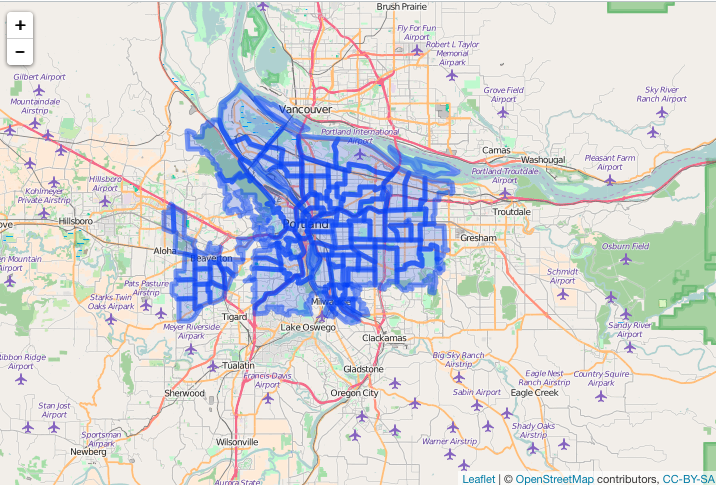

siftgeojson
======


`siftgeojson` - sift geojson with `jq`

## Install


```r
devtools::install_github("ropenscilabs/siftgeojson")
```


```r
library("siftgeojson")
```

## e.g.

Using Zillow data, plot all data


```r
library("leaflet")
file <- system.file("examples", "zillow_or.geojson", package = "siftgeojson")
dat <- jsonlite::fromJSON(file, FALSE)
```


```r
leaflet() %>% 
  addTiles() %>% 
  addGeoJSON(dat) %>% 
  setView(-122.8, 44.8, zoom = 8)
```


Filter to features in Multnomah County only


```r
json <- paste0(readLines(file), collapse = "")
res <- sifter(json, COUNTY == Multnomah)
```

Check that only Multnomah County came back


```r
res %>% 
  jqr::index() %>% 
  jqr::dotstr(properties.COUNTY)
#> [
#>     "Multnomah",
#>     "Multnomah",
#>     "Multnomah",
#>     "Multnomah",
#>     "Multnomah",
#>     "Multnomah",
#>     "Multnomah",
#>     "Multnomah",
#>     "Multnomah",
...
```

Plot it


```r
leaflet() %>% 
  addTiles() %>% 
  addGeoJSON(dat) %>% 
  setView(-122.6, 45.5, zoom = 10)
```



## Meta

* Please [report any issues or bugs](https://github.com/ropenscilabs/sifter/issues).
* License: MIT
